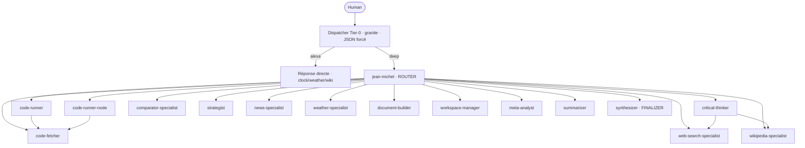
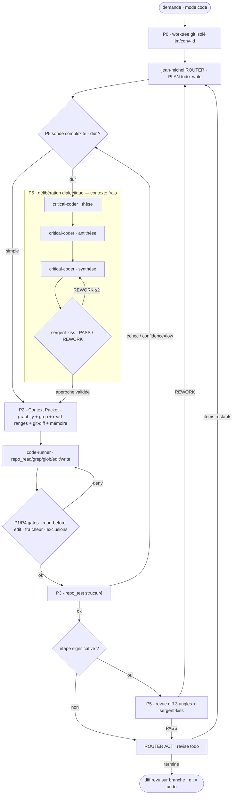

# Plan — Jean-Michel : intervention codebase réelle + contexte déterministe + délibération dialectique

> ## ✅ STATUT 2026-06-12 — P0→P6 LIVRÉS (709 tests verts, opt-in `CODE_WORKTREE_ENABLED`)
>
> | Phase | Pièces clés (livrées + testées) |
> |---|---|
> | **P0** | `worktree.py` + config `PROJECT_ROOT`/`REPO_PROTECTED_PATHS` + câblage `conversation.py` |
> | **P1** | `repo_read/grep/glob/edit/write` (`_repo.py`) + gates read-before-edit/fraîcheur/protected · migrate_128 |
> | **P2** | `context_packet.py` (CRP) câblé dans `spawn_subagent` |
> | **P3** | `repo_test` (structuré) + `repo_graph_refresh` + graphify→code-runner · migrate_129 |
> | **P4** | paradigmes `repo_intervention_discipline` + `prefer_repo_tools_over_bash` (code-mode, 2 workers) · migrate_130 |
> | **P5** | `critical-coder` + `sergent-kiss` + `deliberation.py` (amont+aval, REWORK≤2) · migrate_131 |
> | **P6** | `--synoptic` + `--orchestrator-map` (docs générés) · fix comparator (migrate_132) · **summarizer CONSERVÉ** |
>
> **Ajouts hors-plan (session) :** graphify auto-start aussi en `--serve` (parité CLI) ; `--help` complété ;
> conflit de port 8765 corrigé (paradigm-matrix → 8770) ; `repo_test` auto-détecte l'interpréteur ;
> conftest épingle `CODE_WORKTREE_ENABLED=off` (déterminisme suite). **Tout non committé** (commit manuel, phase/phase).
>
> ### Reste à faire
> 1. **Validation E2E réelle — LE test de la thèse** : Ollama + `CODE_WORKTREE_ENABLED=1` + graphify servi,
>    une vraie petite feature multi-fichiers en `--mode code`. Tableau de bord : `--synoptic` + `--orchestrator-map`.
>    Puis rejouer avec un **codeur plus petit** → valider « contexte solide ⇒ petit modèle suffit ».
> 2. **Tuning post-observation** : seuils `complexity_probe` ; `sergent-kiss` `model_override` (NULL aujourd'hui) ;
>    diff aval (actuellement diff worktree complet → affiner au delta du step si bruyant).
> 3. **Non-régression** : rejouer hors mode code (research/chat/vocal/comparaison) → zéro fuite.
> 4. **Optionnel** : auditer/rafraîchir la GUI `paradigm-matrix` (signalée « peut-être pas à jour »).

---

# ROUND 2 — plan d'exécution (2026-06-12)

Quatre chantiers décidés avec l'utilisateur : commits, refresh paradigm-matrix, et **2 docs**
(prép E2E/tuning + design « brancher un repo » — *design only ce tour, impl. plus tard*).

## W1 — Commits (branche `new_thinking` ; JAMAIS de trailer `Co-Authored-By`)

P0–P5 sont déjà committés. Le non-committé (P6 + finitions session) part en **2 commits à fichiers
disjoints** (pas de `git add -p`, non supporté) :

- **Commit A** — *« P6 : synoptic + carte déterminisme orchestrateur (générés) + fix whitelist comparator + finitions jm.sh »*
  `src/jeanmichel/synoptic.py`, `orchestrator_map.py`, `tests/v2/test_synoptic.py`,
  `test_orchestrator_map.py`, `docs/agents_synoptic.md`, `docs/orchestrator_determinism.md`,
  `db/migrations/migrate_132_comparator_delegation.sql`, `db/schema.sql`,
  `tests/v2/test_migration_idempotence.py`, `README.md`, `jm.sh`, `debug/paradigm_matrix.py`.
  (jm.sh porte `--synoptic`/`--orchestrator-map` + auto-start graphify en `--serve` + fix help/port.)
- **Commit B** — *« repo_test : auto-détection de l'interpréteur + bloc code-mode .env.example + pin déterminisme suite »*
  `src/jeanmichel/config.py`, `src/jeanmichel/tools/repo_test.py`, `tests/v2/test_repo_test_tool.py`,
  `tests/v2/conftest.py`, `.env.example`.
- `.env` (live) est **gitignored** → `CODE_WORKTREE_ENABLED=1` n'est pas committé (correct).
- `pytest tests/v2` doit être vert avant (709/5). Messages courts, FR, sans trailer.

## W2 — Refresh paradigm-matrix (`debug/paradigm_matrix.py`)

La GUI lit la DB en live (agents 19/20 + paradigmes 147/148 apparaissent déjà) mais :
- **CRITIQUE** : l'UI code en dur 3 modes → le mode **`code` est invisible** (paradigmes 142,145-148
  perdent leur toggle). Ajouter `'code'` à `MODES_LIST` + `MODES_SHORT` (`Cd`) + rendre la 4ᵉ colonne
  (le read/write de `paradigm_modes` est déjà générique). Anchors : ~501-502, 508-511, 549-555.
- **IMPORTANT** : exposer `agents.model_override` (SELECT l.39 + affichage colonne/tooltip).
- *Optionnel* : afficher `paradigm_requires_tool` (lecture seule, ex. graphify) + grouper par rôle.
- *Vérif* : `./jm.sh --paradigm-matrix` (port 8770) → les paradigmes code montrent `Cd`, model_override visible.

## W3 — Doc `docs/20260612_improve_thinking/E2E_and_tuning.md` (pour ne pas oublier)

- **Protocole E2E réel** : `CODE_WORKTREE_ENABLED=1` (déjà) + graphify auto-servi (CLI), une vraie
  petite feature multi-fichiers en `--mode code` sur le repo. Checklist d'observation (worktree
  `jm/conv-id` créé · tree live propre · Context Packet dans le briefing worker · gate read-before-edit ·
  `repo_test` structuré · délibération tracée dans `events.jsonl` sur step dur · diff revu + `kiss_review`).
  Tableau de bord : `--synoptic` + `--orchestrator-map`.
- **Test de la thèse petit modèle** : rejouer la même tâche avec `code-runner.model_override` rétréci.
- **Checklist de tuning** (post-observation) : seuils `complexity_probe` (`_HARD_KEYWORDS`, ≥N fichiers) ·
  `sergent-kiss.model_override` (NULL → plus fort si faible) · scope du diff aval (worktree complet →
  delta du step) · coût délibération vs valeur · caps des tranches CRP.

## W4 — Doc `docs/20260612_improve_thinking/branchable_repo_design.md` (design, impl. plus tard)

« Brancher un repo » dynamiquement — **décision : attache au niveau PROJET** (convs code héritent ;
fallback `PROJECT_ROOT` → rétro-compatible ; CLI inchangé).

- **Stockage** : `migrate_133` → `projects.code_repo TEXT DEFAULT ''` + `projects.repo_kind TEXT
  CHECK(repo_kind IN ('local','ssh')) DEFAULT 'local'` ; miroir `schema.sql` ; `db.create_project/
  update_project/get_project` + `service/project.py`.
- **Matérialisation** (`worktree.py`) : `create_worktree(conv_folder, conv_id, source, kind)` —
  *local* → worktree depuis le chemin ; *ssh* → **clone caché par projet** (`repos-cache/<project_id>/repo`,
  hors `conversations/`, lock anti-course) puis worktree depuis le clone. `source` vide → `config.PROJECT_ROOT`.
- **Threading** : `conversation.create_conversation` lit `code_repo`/`repo_kind` du projet → `worktree`.
  `repo_test._default_python`, `repo_graph_refresh`, `context_packet._graphify_slice` : pointer sur la
  **racine du worktree** (le checkout EST le repo) au lieu de `config.PROJECT_ROOT`. Les outils repo
  (`_repo.worktree_root(conv_folder)`) sont déjà per-conv → inchangés.
- **API + front** : `ProjectSaveRequest`/`ProjectUpdateRequest` (api/app.py) + champ
  « Dépôt de code (chemin local ou URL SSH) » + select kind dans `web/src/components/ProjectsDialog.vue`
  (le drawer de conv montre juste mode+projet, hérite).
- **SSH/sécurité** : clone via clés ssh de l'hôte ; outils repo tournent sur l'hôte (repo de confiance,
  posé par le propriétaire du projet) ; documenter le prérequis clés ; échecs de clone → dégradation propre.
- **Bonus git** (todo.md) : outil lecture seule `repo_git` (log/diff/blame/show) pour l'historique en mode repo.
- **Bug à corriger au passage** : `db.list_conversations_for_user` (SELECT ~l.318) omet `project_id`.
- *Numéro de migration libre* : `migrate_133` (132 = comparator).

## Vérification (Round 2)

- W1 : `git log --oneline -3` montre les 2 commits sans trailer ; `git status` propre ; `pytest tests/v2` vert (709/5).
- W2 : `./jm.sh --paradigm-matrix` rend le mode `code` + `model_override` ; aucune régression d'édition (agent_paradigms/paradigm_modes).
- W3/W4 : les 2 docs existent sous `docs/20260612_improve_thinking/`, scannables, et capturent protocole + design.

---

## Context (pourquoi)

Jean-Michel fonctionne : orchestrateur PDCA, workers à contexte frais, TODO vivant, sandbox
Docker verrouillé, mémoire scopée, graphify (graphe de code déterministe) câblé en MCP. Le travail
est solide et déjà très proche, sur le papier, de Claude Code (cf. `DevNotes/ORCHESTRATOR/01` et
`02`).

**Le vrai trou**, vérifié dans le code, est ailleurs : **Jean-Michel ne touche jamais une vraie
codebase.** Les workers n'écrivent que dans un *scratch* par conversation
(`conversations/<id>/workspace/`, [_workspace.py:18](src/jeanmichel/tools/_workspace.py#L18)),
le sandbox ne monte QUE ce scratch ([bash_sandbox.py:77](src/jeanmichel/tools/bash_sandbox.py#L77)),
et l'accès aux sources réelles (`repo_read_file`) a été **explicitement abandonné** le 2026-05-22
(`docs/20260522_introspection_repo_access/SPRINT.md:79`). Graphify (2026-06-08) a ajouté une
navigation *structurelle en lecture seule* du repo, mais **aucun agent ne peut lire le contenu d'un
fichier source ni éditer un repo en place.** D'où l'écart ressenti avec « Claude dans VSCode ».

Second trou, qui est le cœur de la demande : la **qualité du contexte d'une micro-action dépend du
briefing rédigé par le router LLM** (leur propre levier #1, D4 de `ORCHESTRATOR/01`) — donc
non-déterministe. Avec des petits modèles « un peu cons », ce levier casse. Il faut que
**l'orchestrateur reconstruise mécaniquement le contexte**, pour que le worker l'*exécute* au lieu
de le *deviner*.

**Troisième trou — la méthode de réflexion.** Un petit modèle qui s'engage seul sur une approche part
vite en **impasse d'hallucination** (il creuse une mauvaise piste sans la remettre en cause). Il
manque un **processus de réflexion posé et orchestré** : explorer plusieurs angles avant de trancher,
et couper l'over-engineering. C'est un raisonnement type Claude (envisager l'approche, l'attaquer,
réconcilier, préférer le plus simple) — à rendre **déterministe** ici.

**Décisions verrouillées avec l'utilisateur (2026-06-12) :**
1. **Édition in-place sur un vrai repo git** (style Claude Code ; git = filet de sécurité).
2. **Étage déterministe « context packet »** entre PLAN et DO (le LLM ne reconstruit plus le contexte).
3. **Repo cible n°1 = le projet jean-michel lui-même** (dogfood ; graphe graphify déjà construit,
   tests pytest présents). La capacité visée est **repo-agnostic** : jean-michel-le-projet n'est que
   le premier sujet de test, pas la finalité.
4. **Couche de délibération dialectique pour le code** (thèse/antithèse/synthèse + gate sergent-KISS),
   généralisant `critical-thinker` en `critical-coder` — **déclenchement sélectif** (tâche dure /
   worker bloqué), portant **à la fois sur l'approche (amont) et sur le diff produit (aval)**.

**Résultat visé** : en mode `code`, **le système** intervient sur une copie git isolée d'un repo
cible — lit/grep/édite les vrais fichiers, lance les vrais tests — et chaque délégation embarque un
contexte assemblé par du code Python déterministe (graphe + grep + extraits source + diff récent).
Payoff de la thèse : contexte solide ⇒ on pourra rétrécir le modèle codeur (plus besoin d'un gros
modèle pour reconstruire le contexte).

---

## Cadrage — « jean-michel » a deux sens, ne pas les confondre

- **le système / le projet jean-michel** = toute la **chaîne** (dispatcher → router → orchestrateur
  déterministe → workers → outils → hooks → DB/paradigmes). **C'est LUI qui doit savoir adresser une
  codebase.** Tout ce plan est une capacité **système**, pas une amélioration d'un agent.
- **l'agent `jean-michel`** = le **router**, **un seul maillon** de la chaîne (il décide *quel* step
  et *quel* worker — jugement LLM gardé par les hooks). Il ne porte pas la capacité codebase.

Conséquence directe sur la décision n°2 : **le contexte est reconstruit par le code de
l'orchestrateur (CRP), pas par l'agent-router** — précisément pour ne PAS dépendre de l'intelligence
d'un maillon. « Dogfood jean-michel » = le système opère sur le **repo du projet** jean-michel, pas
« rendre l'agent plus malin ».

### La chaîne : qui adresse la codebase (qui possède quoi)

| Maillon | Nature | Responsabilité codebase |
|---|---|---|
| Dispatcher (Tier-0) | LLM gardé (JSON forcé) | reconnaître l'intention « code » |
| Agent router `jean-michel` | LLM, maillon | PLAN/CHECK/ACT : *quel* step, *quel* worker (pas le contexte) |
| **Orchestrateur** | **Python déterministe** | **worktree, Context Packet (CRP), gates — le cœur de la capacité** |
| Workers (`code-runner`, `code-fetcher`) | LLM, maillons | exécuter la micro-action sur le repo |
| Couche outils | déterministe (hôte) | `repo_read/grep/glob/edit/write/test` + graphify |
| Hooks | déterministe | read-before-edit, fraîcheur, exclusions dures |
| DB / paradigmes | données | discipline code (anglais, model-agnostic) |
| **Délibération** (`critical-coder` ×3 angles + `sergent-kiss`) | LLM, **séquencés par du Python** | thèse/antithèse/synthèse + gate anti-over-engineering, déclenchés sélectivement |

---

## Cartographie du système (mermaid)

> Rectangles = maillons **LLM** · losanges = décisions/gates **déterministes (Python)** · `P0…P5` = phases du plan.

### 1) Roster & délégation — état actuel (base live)



*Surfacé par la carte (à corriger, candidat P6) : `comparator-specialist` n'a **aucune** cible de
délégation en base alors que sa mission décrit des « délégations parallèles aux spécialistes » —
dérive mission ↔ grants.*

### 2) Pipeline cible — mode `code` (où chaque phase s'insère)



---

## Principe directeur (K.I.S.S, pas de MUST en cascade)

- **Navigation/édition = outils hôte déterministes** (Python + `rg`/`git`, déjà présents :
  `rg` 15.1, `git` 2.54). **Exécution = sandbox** (inchangé, posture verrouillée conservée).
  C'est exactement le partage de Claude Code.
- **On ne réécrit pas l'orchestrateur.** Le PDCA reste : le router PLAN (todo_write), CHECK
  (report_back), ACT (revise todo). On insère le context packet **dans le DO** et on durcit deux
  gates via les hooks existants. Zéro résurrection de `set_task_class`/phases.
- **Isolation par worktree git** : l'agent travaille sur une branche/worktree, **jamais** le tree
  live. Pas de pipeline de patch maison : git EST le staging et l'undo.
- **Paradigmes** : en anglais, model-agnostic (route par `agents.model_override`), `rationale` =
  note dev non injectée. Dual-write `schema.sql` ↔ migration, appliqué à la base live.

---

## Architecture cible — 6 piliers

### Pilier 1 — Project root + isolation worktree (fondation + sécurité)
- Concept **project root** = le repo cible. Phase 1 : `config.REPO_ROOT`
  ([config.py:13](src/jeanmichel/config.py#L13)), paramétrable via `JEANMICHEL_PROJECT_ROOT`
  (défaut = REPO_ROOT) pour préparer un repo externe plus tard sans abstraction prématurée.
- À l'ouverture d'une conversation `code`, créer un **git worktree** sur une branche dédiée
  (`jm/conv-<id>`) — réutiliser la machinerie de [snapshot.py](src/jeanmichel/snapshot.py) et
  `CONVERSATION_SNAPSHOT_ENABLED` ([config.py:100](src/jeanmichel/config.py#L100)). Le worktree est
  le « workspace » réel ; le scratch actuel reste pour les tâches non-repo.
- **Exclusions dures** (deny au niveau hook, jamais éditables) : `jeanmichel.db`, `.env`,
  `.api_secret`, `conversations/`, `backups/`, `voice_models/`, `.venv/`, `graphify-out/`.

### Pilier 2 — Outils repo déterministes (les « mains » VSCode)
Nouveaux outils hôte, scopés au worktree, contrats repris **verbatim** de Claude Code que l'équipe a
déjà documentés (`DevNotes/ORCHESTRATOR/02` §5). Modèle : étendre `_workspace.py` (`safe_resolve`,
quota) vers un `_repo.py` pointant sur le worktree.

| Outil | Contrat (gravé dans la description) | Réutilise |
|---|---|---|
| `repo_read` | format `cat -n`, `offset`/`limit`, **stub FILE_UNCHANGED** si relu (dedup) | `workspace_view.py` |
| `repo_grep` | backend `rg`, `output_mode`, `-A/-B/-C`, `head_limit` (signale la troncature) | nouveau (host `rg`) |
| `repo_glob` | pattern de fichiers, cap 100 | nouveau (host) |
| `repo_edit` | `old_string` **unique**, préserve l'indentation, **read-before-edit + check de fraîcheur (mtime)** | `workspace_str_replace.py` |
| `repo_write` | crée / réécrit ; read-first obligatoire si écrasement | `workspace_create_file.py` |

Grantés à `code-runner` (et `repo_read`/`repo_grep`/`repo_glob` à `code-fetcher` pour le lookup interne).

### Pilier 3 — Context Reconstruction Pipeline (CRP) — le cerveau, cœur de la demande
Nouveau module `context_packet.py` : **fonction Python pure, zéro appel LLM**. Au moment du DO
(juste avant `spawn_subagent`), à partir de `(item TODO, briefing, support_files)`, assemble un
**Context Packet** compact et l'injecte dans le message initial du worker.

Point d'injection exact : [orchestrator_v2.py:1048 `_format_subagent_briefing`](src/jeanmichel/orchestrator_v2.py#L1048)
(→ `spawn_subagent` [835-836](src/jeanmichel/orchestrator_v2.py#L835)). Le router fournit déjà
`briefing` + `support_files` ([orchestrator_v2.py:657-668](src/jeanmichel/orchestrator_v2.py#L657)).

Tranches du packet (toutes déterministes) :
1. **Ancre tâche** : item TODO + goal (depuis `todo.json`).
2. **Tranche structurelle (graphify)** : pour chaque symbole/fichier de `support_files` + identifiants
   extraits du briefing (regex), appels déterministes `get_node` / `get_neighbors` / `affected` /
   `shortest_path` → voisinage d'appel, callers/callees, « ce qui casse si on touche X ».
3. **Tranche lexicale (grep)** : `rg` sur ces identifiants → hits `fichier:ligne` exacts.
4. **Tranche source (read)** : extraits de plages précises (corps des fonctions visées) en `cat -n`
   → le worker a ses **ancres read-before-edit** sans aller les chercher.
5. **Tranche diff récente** : `git diff` du worktree depuis le début du tour → « ce qui vient de
   changer » (les workers ne sont plus aveugles aux étapes précédentes).
6. **Tranche mémoire** : existant (`render_memory_block`, scope project/tool).

Le router décide TOUJOURS *quel* item et *quel* worker (jugement LLM, gardé par les hooks) ; le code
assemble *le contexte*. C'est le « border the logic » demandé : le levier #1 (D4) devient déterministe.

### Pilier 4 — Gates déterministes (hooks existants, pas de nouveau MUST)
Via `PreToolUse`/`PostToolUse` ([hooks.py:153+](src/jeanmichel/hooks.py#L153), `dedup_cache` déjà présent) :
- **Read-before-edit** : `repo_edit`/`repo_write`(écrasement) DENY si le fichier n'a pas été
  `repo_read` dans ce tour. (Le `dedup_cache` trace déjà les appels.) Gate le plus rentable.
- **Fraîcheur** : edit refusé si `mtime` a changé depuis le read (comme Claude Code).
- **Graphe stale** : après tout `repo_edit`/`repo_write`, PostToolUse marque le graphe périmé +
  injecte un rappel ; `graphify update` (≈5 s, déterministe) en fin de tour pour le tour suivant.

### Pilier 5 — Boucle de test réelle + graphify pour l'éditeur
- `repo_test` : lance les tests du projet dans le worktree et renvoie un **résultat structuré**
  `{passed, failed[], summary}` (parsing du `pytest`), au lieu d'un stdout brut à interpréter.
  **Dogfood jean-michel** : exécution via `.venv/bin/python -m pytest` (cf. convention venv du projet)
  avec `cwd=worktree` — le worktree est du code de confiance (le repo lui-même), git-isolé.
  (Le `bash_sandbox` reste pour exécuter du code *généré* arbitraire.)
- **Graphify granté à `code-runner`** : aujourd'hui les tools `mcp__graphify__*` ne vont qu'à
  `jean-michel` + `code-fetcher` (catégorie `code` dans `mcp_servers.toml`) ; **l'agent qui édite ne
  peut pas interroger le graphe** → ajouter `code-runner` à la catégorie `code`.

### Pilier 6 — Couche de délibération dialectique (la « méthode de réflexion »)
Sous-routine **orchestrée par du code** (le LLM ne décide pas de réfléchir — l'orchestrateur le fait),
déclenchée **sélectivement**. Deux nouveaux agents, model-agnostic (route via `model_override`) :
- **`critical-coder`** = `critical-thinker` reciblé code/archi (réutilise ses paradigmes :
  `assumption_surface`, `steelman_first`, `hold_tension`, `binary_resistance`, `occam_razor`,
  `burden_of_proof`, `understand_before_judge`). UN agent, invoqué avec un **angle** différent par passe.
- **`sergent-kiss`** = gate anti-over-engineering. Tranche **PASS | REWORK(raison)** via une sortie
  structurée interceptée déterministiquement (leçon `convergence_gate` : jamais de score halluciné).

**Déclencheur déterministe** (pas le LLM) : sonde de complexité — cible un god-node (graphify
`god_nodes`/`affected`), ≥ N fichiers, ou choix d'archi — **ou** réactif quand un worker rend
`confidence=low` / un `repo_test` échoue (anti-impasse littéral). Les steps simples sautent.

**Mise en musique — amont (approche), avant d'écrire :**
```
thèse      = spawn(critical-coder, angle=thesis,     context_packet)             # approche directe
antithèse  = spawn(critical-coder, angle=antithesis, packet + thèse)             # on l'attaque : failure modes, alt + simple
synthèse   = spawn(critical-coder, angle=synthesis,  packet + thèse + antithèse) # meilleure approche, la plus simple qui survit
verdict    = spawn(sergent-kiss,   synthèse)                                     # PASS | REWORK(raison) — boucle bornée (≤2)
→ l'approche validée alimente todo_write (PLAN) + les briefings CRP
```
**Aval (revue du diff), après une étape significative :**
```
3 revues = spawn(critical-coder, angle ∈ {correctness, simplicity, side_effects}, diff + packet + graphify affected)
verdict  = spawn(sergent-kiss, diff + 3 revues)   # PASS | REWORK → nouvel item TODO / re-délégation code-runner
```
Chaque passe = **contexte frais** (`spawn_subagent`), angle = **briefing déterministe** (paradigme DB,
anglais, mode `code`). Le CRP (Pilier 3) **nourrit les precogs** : ils raisonnent sur un terrain
assemblé, pas sur du vent. Le sergent-KISS garde aussi *le processus* (peut signaler une délibération
inutile sur un step trivial → on retune la sonde).

---

## Audit du roster — overlaps & implications par type de tâche

16 agents actifs, ~9 types de tâche. Le boost code ne doit **rien retirer** aux autres types — au
contraire. État live (base) :

| Type de tâche | Agent(s) | Note overlap |
|---|---|---|
| Conversation / réponse directe | `jean-michel` (router) | porte **46 paradigmes** (le plus chargé) |
| Recherche web / factuel | web-search, wikipedia, news, weather | frontières propres |
| Lookup dev | `code-fetcher` | léger overlap web_fetch avec web-search (OK) |
| Décompo exploratoire | `strategist` | research only (3-7 axes) |
| Comparaison | `comparator-specialist` | — |
| Analyse critique | `critical-thinker` | 38 paradigmes |
| **Code + exécution** | `code-runner`, `code-runner-node` | **jumeaux** (seule diff = image) — cible du boost |
| Document / synthèse | `document-builder`, `summarizer`, `synthesizer` | **overlap réel** (voir ci-dessous) |
| Méta / auto-amélioration | `meta-analyst` | ne peut pas lire les sources réelles |

**Overlaps actionnables (classés) :**
1. **`summarizer` ⊂ {`synthesizer`, `document-builder`}** — condenser/structurer du texte. `summarizer`
   n'a **aucun outil d'écriture** (view/list only). → candidat **retrait**, *après vérification de
   l'usage réel* dans `conversations/` ; sinon le fondre. (Hors chemin critique → P5.)
2. **`code-runner` / `code-runner-node`** : jumeaux **volontaires** (« 1 worker = 1 image », doc 03).
   **Ne pas fusionner.** Mais l'upgrade code (repo tools, CRP, paradigmes) doit passer par des
   **paradigmes mode `code` + grants partagés**, jamais en éditant un seul agent → sinon les deux
   divergent (régression côté node). C'est à la fois consolidation ET prévention d'effet de bord.
3. **Sprawl critical-thinking** : ~20 paradigmes dupliqués via `agent_paradigms` (jean-michel 46,
   critical-thinker 38, comparator 29, wikipedia 24…). Dette de cohérence **hors chemin critique** —
   y toucher = risque transverse. Noté, **pas traité dans ce plan**.
4. **2 moteurs de décomposition** : `strategist` (research) vs router-PDCA (code), séparés par domaine.
   Le **CRP est un 3ᵉ mécanisme de contexte → strictement scopé au mode `code`** (cf. garde-fous).
5. **`critical-coder` = généralisation de `critical-thinker` au code** (Pilier 6) — **NON fusionnés** :
   critical-thinker sert analyse/chat, critical-coder le mode `code`. ADN paradigmes partagée, cycles
   de vie distincts.

**Spillover positif (améliorer les autres tâches « au contraire ») :** granter `repo_read`/`repo_grep`/
`repo_glob` (lecture seule) au **`meta-analyst`** → il lit enfin les vraies sources (le besoin de
`repo_read_file` abandonné en mai) et ses propositions deviennent concrètes. Même brique, autre type
de tâche amélioré.

## Garde-fous anti-régression (ne PAS détériorer les autres tâches)

Mécanisme confirmé dans [db.py:73-74](src/jeanmichel/db.py#L73-L74) : un paradigme **sans** ligne
`paradigm_modes` s'applique à **TOUS** les modes ; **avec** lignes mode, il est limité à ces modes.
Aujourd'hui 120 paradigmes actifs, **15 seulement** mode-gated. D'où les invariants à tenir :

- **Tout nouveau paradigme code → ligne `paradigm_modes='code'` UNIQUEMENT** (jamais global/sans mode,
  sinon fuite dans chat/analyse/vocal). Modèle correct existant : `pdca_decompose_delegate_revise`.
- **CRP, worktree, repo tools : actifs uniquement en mode `code` / pour les agents code.** Les
  délégations research/comparaison/chat passent par le chemin de briefing **inchangé**.
- **`repo_*` sont des outils NEUFS** (pas une modif des `workspace_*`) → zéro régression sur les flux
  workspace des agents research/doc.
- **Test de non-régression obligatoire en fin de chantier** : rejouer un brief research
  (strategist→specialists), une comparaison, un tour chat et un tour vocal → vérifier qu'aucun
  paradigme/outil code n'a fuité et que la latence hors-code est inchangée.

## Plan séquencé (chaque phase livrable + testable) — la TODO

> Ordre = rentabilité décroissante × dépendances. À reporter dans `TodoWrite` à l'implémentation.

- [ ] **P0 — Project root + worktree (fondation, sécurité).**
  `config.PROJECT_ROOT` (défaut REPO_ROOT) ; création/teardown d'un worktree `jm/conv-<id>`
  (réutiliser `snapshot.py`) au 1ᵉʳ tour `code` ; liste d'exclusions dures.
  *DoD* : une conv `code` obtient un worktree isolé du repo ; le tree live n'est jamais touché ;
  exclusions refusées. Tests unitaires worktree + exclusions.

- [ ] **P1 — Outils repo déterministes.**
  `_repo.py` + `repo_read`/`repo_grep`/`repo_glob`/`repo_edit`/`repo_write` (contrats CC), grants
  `code-runner` (+ lecture à `code-fetcher`), gates read-before-edit & fraîcheur dans `PreToolUse`.
  *DoD* : code-runner navigue + édite le worktree, read-before-edit appliqué ; un test par outil + un
  test par gate. (Migration grants + mirror `schema.sql` + live.)

- [ ] **P2 — Context Reconstruction Pipeline (cœur).**
  `context_packet.py` (pur, déterministe) ; câblage dans `_format_subagent_briefing` /
  `spawn_subagent` ; tranches graphify + grep + read-ranges + git-diff + mémoire.
  *DoD* : les délégations en mode `code` embarquent un packet assemblé mécaniquement ; E2E sur une vraie
  petite modif multi-fichiers de jean-michel ; baisse mesurable des tool-calls « aveugles » du worker.

- [ ] **P3 — Fraîcheur graphe + boucle de test structurée.**
  `graphify update` worktree post-édition/fin de tour + rappel stale ; `repo_test` (résultat
  structuré) ; gate souple « tester après édition avant de marquer done » ; graphify granté à code-runner.
  *DoD* : graphe frais ; résultats de tests structurés injectés ; le router révise le TODO sur échec.

- [ ] **P4 — Durcissement des paradigmes (DB, anglais, model-agnostic).**
  **Tous gated `paradigm_modes='code'`** (garde-fou anti-fuite) : `repo_intervention_discipline`
  (read-before-edit, grep/graph-first, diff minimal, test-after) + les directives CC déjà minées
  (concision, « do what's asked, nothing more », `file_path:line`, sécurité, préférer l'outil dédié à
  bash). **Bindés aux DEUX workers code (`code-runner` + `code-runner-node`)** pour qu'ils ne divergent
  pas. Renforcer `graphify_codebase_navigation` + le binder à `code-runner`. Granter `repo_read/grep/
  glob` (lecture seule) au `meta-analyst` (spillover).
  *DoD* : paradigmes en DB + mirror schema + live ; compteurs de tests MAJ ; suite verte ; aucun
  paradigme code visible hors mode `code` (assertion de test).

- [ ] **P5 — Couche de délibération dialectique (la méthode de réflexion, headline).**
  Agents `critical-coder` (angles thèse/antithèse/synthèse + review:correctness/simplicity/side_effects)
  et `sergent-kiss` (gate PASS/REWORK structuré, intercepté déterministiquement) ; paradigmes d'angle
  (mode `code`) ; **sonde de complexité déterministe** + trigger réactif (`confidence=low` / test
  échoué) ; orchestration amont (approche→PLAN) et aval (revue diff) avec boucle REWORK bornée (≤2) ;
  les precogs consomment le Context Packet (P2).
  *DoD* : sur une tâche dure, 3 angles + gate tracés dans `events.jsonl`, approche validée AVANT
  écriture, REWORK borné fonctionne ; un step trivial **ne déclenche PAS** la délibération (sonde) ;
  suite verte.

- [ ] **P6 — Consolidation (optionnel, hors chemin critique).** Vérifier l'usage réel de `summarizer`
  dans `conversations/` → retirer si mort (réduit roster + surface de swap modèle). Ne PAS toucher au
  sprawl critical-thinking dans ce plan (risque transverse). *DoD* : décision summarizer tranchée sur
  données, pas sur intuition ; roster inchangé par ailleurs.

---

## Sécurité / vérité crue (à ne pas enjoliver)

- **L'agent édite SON PROPRE repo.** Sans worktree, un edit foireux casse le système en cours
  d'exécution. → P0 (worktree + exclusions dures) est un **prérequis non négociable**, pas un confort.
- **`repo_test` sur l'hôte** (hors sandbox network=none) est une entorse assumée à la posture sandbox,
  justifiée car le worktree = leur propre code de confiance, git-isolé. Pour du code *généré*
  arbitraire, on reste dans le sandbox. À réévaluer si la cible n°1 devient un repo externe non fiable.
- **Fraîcheur du graphe** : le graphe graphify est construit sur REPO_ROOT, pas sur le worktree ; après
  édition il est périmé. La tranche diff récente (CRP) couvre le delta ; P3 le rafraîchit. Honnête :
  entre deux `graphify update`, les requêtes structurelles reflètent l'avant-édition.
- **Coût latence** : CRP = quelques `rg`/`git diff`/requêtes graphe (tout déterministe, local, ~ms à
  qq s) par délégation. Acceptable ; pas d'appel LLM ajouté.
- **Repo externe (cible n°2, hors scope ici)** : nécessitera graphify rebuild sur ce repo + image
  sandbox adaptée (C# ≠ py-alpine). Le `PROJECT_ROOT` paramétrable de P0 le prépare sans le livrer.
- **La délibération peut devenir l'over-engineering qu'elle combat** : 3-4 appels LLM séquentiels sur
  1 GPU. Mitigation **non négociable** : sonde de complexité déterministe (sélectif), boucle REWORK
  bornée (≤2), sergent-KISS qui signale une délibération inutile. Si la sonde fire trop → la retuner,
  pas l'enlever.

---

## Vérification (E2E dogfood)

En mode `code`, soumettre au **système** une vraie petite feature multi-fichiers sur le repo cible
(le projet jean-michel) et observer, dans `events.jsonl` + le worktree :
1. Un **worktree `jm/conv-<id>`** est créé ; le tree live reste intact (`git status` propre).
2. Le router émet un `todo.json` (décomposition PDCA, un seul `in_progress`).
3. Chaque `delegate_to` porte un **Context Packet** (graphe + grep + extraits + diff) — vérifiable
   dans le message initial du worker.
4. `repo_edit` est **refusé** tant que `repo_read` n'a pas eu lieu (gate read-before-edit).
5. `repo_test` renvoie un résultat **structuré** ; le router révise le TODO sur échec.
6. À la fin : un **diff revu** sur la branche ; rien d'écrit dans `jeanmichel.db`/`.env`/`conversations/`.
7. Sur un step **dur** : thèse/antithèse/synthèse + verdict `sergent-kiss` tracés ; sur un step
   **trivial** : aucune délibération (la sonde n'a pas fire). Une boucle REWORK borne bien.
- `pytest tests/v2` reste vert (les nouveaux outils/gates/CRP sous `MockClient`).

**Non-régression (le « ne pas casser les autres tâches »)** : rejouer hors mode `code` un brief
research (strategist→specialists), une comparaison, un tour chat et un tour vocal → confirmer
qu'aucun paradigme/outil code n'a fuité (assertion sur le prompt rendu), roster + latence inchangés.

## Validation de la thèse (payoff modèles plus petits)

Une fois P2 livré : rejouer **la même tâche** avec et sans CRP, puis avec le worker codeur rétréci
(modèle plus petit/spécialisé via `agents.model_override`, sans toucher au code). Hypothèse à valider :
**CRP solide ⇒ un petit codeur tient**, parce qu'il exécute un contexte pré-assemblé au lieu de le
reconstruire. C'est le critère de succès du projet.
