# Agent synoptic — chaînes logiques

> Généré depuis `jeanmichel.db` le 2026-06-13 00:53 UTC (commit `7f2be97`). Ne pas éditer à la main — régénérer avec `./jm.sh --synoptic`.

Rectangles = maillons LLM · losange = dispatch · sous-graphe = délibération (invoquée par le moteur, mode code). Les arêtes pleines = `delegate_to` (table `agent_delegation_targets`).

## Flux de délégation

```mermaid
flowchart TD
  User([Human]) --> DISP["Dispatcher · Tier-0 (alexa | deep)"]
  DISP -->|alexa| ALEXA["Direct answer"]
  DISP -->|deep · analyse/chat/vocal| jean_michel
  DISP -->|deep · code mode| code_router
  jean_michel["jean-michel<br/>router · default"]
  summarizer["summarizer<br/>specialist · default"]
  synthesizer["synthesizer<br/>finalizer · default"]
  weather_specialist["weather-specialist<br/>specialist · default"]
  wikipedia_specialist["wikipedia-specialist<br/>specialist · default"]
  comparator_specialist["comparator-specialist<br/>specialist · gemma4:26b"]
  critical_thinker["critical-thinker<br/>specialist · gemma4:26b"]
  document_builder["document-builder<br/>specialist · default"]
  workspace_manager["workspace-manager<br/>specialist · default"]
  meta_analyst["meta-analyst<br/>specialist · gemma4:26b"]
  code_runner["code-runner<br/>specialist · qwen3-coder:latest"]
  web_search_specialist["web-search-specialist<br/>specialist · default"]
  strategist["strategist<br/>specialist · gemma4:26b"]
  news_specialist["news-specialist<br/>specialist · default"]
  code_fetcher["code-fetcher<br/>specialist · default"]
  code_runner_node["code-runner-node<br/>specialist · qwen3-coder:latest"]
  code_router["code-router<br/>router · qwen3:14b"]
  jean_michel --> code_fetcher
  jean_michel --> code_runner
  jean_michel --> code_runner_node
  jean_michel --> comparator_specialist
  jean_michel --> critical_thinker
  jean_michel --> document_builder
  jean_michel --> meta_analyst
  jean_michel --> news_specialist
  jean_michel --> strategist
  jean_michel --> summarizer
  jean_michel --> weather_specialist
  jean_michel --> web_search_specialist
  jean_michel --> wikipedia_specialist
  jean_michel --> workspace_manager
  comparator_specialist --> news_specialist
  comparator_specialist --> weather_specialist
  comparator_specialist --> web_search_specialist
  comparator_specialist --> wikipedia_specialist
  critical_thinker --> web_search_specialist
  critical_thinker --> wikipedia_specialist
  code_runner --> code_fetcher
  code_runner_node --> code_fetcher
  code_router --> code_fetcher
  code_router --> code_runner
  code_router --> code_runner_node
  subgraph DELIB ["Deliberation · engine-invoked · code mode"]
    critical_coder["critical-coder<br/>thesis / antithesis / synthesis / review"]
    sergent_kiss["sergent-kiss<br/>PASS / REWORK gate"]
    critical_coder --> sergent_kiss
  end
  code_router -. hard code step .-> DELIB
  classDef router fill:#e6f3ff,stroke:#0366d6,stroke-width:2px;
  classDef finalizer fill:#eaffea,stroke:#2da44e;
  class jean_michel router;
  class synthesizer finalizer;
  class code_router router;
```

## Roster

| Agent | Role | Model | Tools | Paradigms | Delegates to |
|---|---|---|--:|--:|---|
| `code-router` | router | qwen3:14b | 3 | 15 | code-fetcher, code-runner, code-runner-node |
| `jean-michel` | router | default | 8 | 46 | code-fetcher, code-runner, code-runner-node, comparator-specialist, critical-thinker, document-builder, meta-analyst, news-specialist, strategist, summarizer, weather-specialist, web-search-specialist, wikipedia-specialist, workspace-manager |
| `code-fetcher` | specialist | default | 13 | 12 | — |
| `code-runner` | specialist | qwen3-coder:latest | 18 | 16 | code-fetcher |
| `code-runner-node` | specialist | qwen3-coder:latest | 18 | 15 | code-fetcher |
| `comparator-specialist` | specialist | gemma4:26b | 5 | 29 | news-specialist, weather-specialist, web-search-specialist, wikipedia-specialist |
| `critical-coder` · engine | specialist | gemma4:26b | 4 | 7 | — |
| `critical-thinker` | specialist | gemma4:26b | 5 | 38 | web-search-specialist, wikipedia-specialist |
| `document-builder` | specialist | default | 6 | 16 | — |
| `meta-analyst` | specialist | gemma4:26b | 12 | 20 | — |
| `news-specialist` | specialist | default | 8 | 11 | — |
| `sergent-kiss` · engine | specialist | default | 2 | 2 | — |
| `strategist` | specialist | gemma4:26b | 3 | 3 | — |
| `summarizer` | specialist | default | 2 | 12 | — |
| `synthesizer` | finalizer | default | 2 | 18 | — |
| `weather-specialist` | specialist | default | 1 | 10 | — |
| `web-search-specialist` | specialist | default | 9 | 13 | — |
| `wikipedia-specialist` | specialist | default | 7 | 24 | — |
| `workspace-manager` | specialist | default | 8 | 11 | — |
